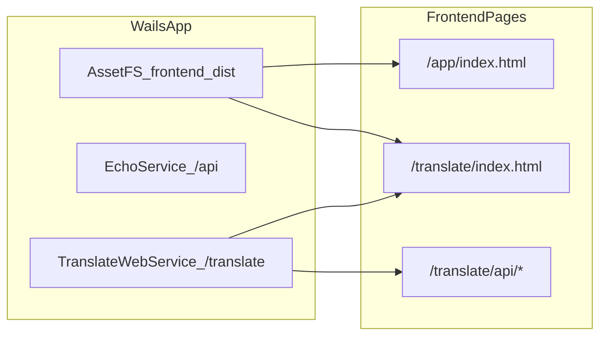

# Kakapo

> Translator, but smart.

Kakapo 是一款开源的跨语言翻译桌面应用，核心能力是**多语言互译**：对接任意 OpenAI 兼容接口（Kimi/Moonshot、DeepSeek、OpenAI 及自定义服务），可并行调用多家服务商进行翻译对比，API Key 安全存储于系统密钥链。

项目基于 [Wails v3](https://v3alpha.wails.io/)（Go + 原生 WebView）构建，同时也是一份完整的桌面应用工程参考：涵盖系统托盘、启动页、应用菜单、定时事件、本地配置与历史持久化、内置 Echo API 等要素，适合作为学习与二次开发的脚手架。

## 项目特性

- 多语言互译（调用 OpenAI 兼容 `Chat Completions`，支持源/目标语言自由切换与并行多目标语言）
- 多服务商管理：可同时配置并启用多个服务商（Kimi/Moonshot、DeepSeek、OpenAI、自定义接口），翻译时并行调用所有启用服务商的全部模型
- 模型参数自适应：自动按模型族适配请求参数（`kimi-k2` 系列省略 `temperature`、`thinking=disabled` 并设置较大 `max_tokens`；`deepseek` 系列省略 `temperature`、`reasoning_effort=high`、`thinking=enabled`）
- 翻译设置管理（服务商列表、超时、最大输入、自动复制等）
- 每个服务商的 API Key 各自存储于 macOS Keychain（以服务商 ID 作为账号，不落地到配置文件）
- 接口报错透传：将上游 API 的错误详情透传到界面，便于排查
- 翻译历史记录（本地文件持久化，支持搜索与清空，记录所用服务商）
- 文本朗读（TTS）：基于 macOS `say` 按语言自动选用系统语音，单飞控制避免叠音（非 macOS 返回 501）
- 托盘窗口（点击托盘图标展开翻译页）
- 示例 Echo API（`/api/info`、`/api/users`）
- Wails 事件机制示例（定时事件与前后端事件交互）

## 技术栈

| 层级 | 技术 |
|---|---|
| 桌面框架 | Wails v3（Go + 原生 WebView） |
| 后端 | Go 1.26、Echo v4 |
| 前端 | Vite 5、原生 JavaScript（多页面） |
| 构建任务 | Task (`Taskfile.yml`) |
| 配置存储 | 用户配置目录下的 `settings.json` |
| 密钥存储 | macOS Keychain（`internal/secrets`） |

## 功能与架构

### 1) 核心翻译能力

- 前端翻译页：`/translate/index.html`
- 翻译 API：`/translate/api/*`
  - `POST /translate/api/translate`
  - `GET /translate/api/settings`
  - `PUT /translate/api/settings`
  - `GET /translate/api/history`
  - `POST /translate/api/history`
  - `DELETE /translate/api/history`
  - `POST /translate/api/speak`（文本朗读，TTS）
  - `POST /translate/api/splash`（请求主进程显示「关于」窗口）
- 后端核心：
  - `translate.go` 中的 `TranslateApp`
  - `internal/translate` 中的 OpenAI 兼容客户端与错误映射
  - `internal/config`（设置读写）
  - `internal/history`（历史记录）
  - `internal/secrets`（Keychain）
  - `internal/speech`（系统朗读，macOS `say`）

### 2) 桌面端附加能力

- 系统托盘：`internal/wails/tray`
- 启动窗口（Splash）：`internal/wails/splash`
- 应用菜单：`internal/wails/menu`
- 定时事件发射：`internal/wails/events`
- Dock 服务与 Badge：`main.go`
- 应用元信息服务：`appinfo.go` 中的 `AppInfoService`（向前端提供版本、平台、运行时长等，供「关于」窗口展示；取代脚手架自带的 GreetService）

### 3) 示例 API（Echo）

通过 Wails Service 挂载 Echo 路由到 `/api`：

- `GET /api/info`
- `GET /api/users`
- `GET /api/users/:id`
- `POST /api/users`
- `DELETE /api/users/:id`

### 4) 资源与服务挂载关系



## 目录结构（关键部分）

```text
kakapo/
├── main.go                          # 应用主入口（Wails app + services）
├── server.go                        # Echo 示例服务（/api）
├── server_translate.go              # 翻译页与翻译 API 服务（!server）
├── translate.go                     # 翻译业务核心 TranslateApp
├── appinfo.go                       # AppInfoService（应用元信息/构建版本）
├── pkg/echo/                        # Echo 与 Wails Service 适配封装
├── internal/
│   ├── config/                      # settings.json 读写
│   ├── history/                     # 翻译历史存储
│   ├── secrets/                     # Keychain 抽象与实现
│   ├── speech/                      # 系统朗读（macOS say，含跨平台 stub）
│   ├── translate/                   # OpenAI 兼容翻译客户端
│   └── wails/                       # tray/menu/splash/events
├── frontend/
│   ├── src/projects/app/            # 演示页面
│   ├── src/projects/translate/      # 翻译页面
│   ├── scripts/multiPages.json      # 多页面定义
│   └── scripts/build-all-pages.mjs  # 多页面构建脚本
└── build/
    ├── config.yml                   # Wails 配置
    ├── Taskfile.yml                 # 公共构建任务
    └── darwin/Taskfile.yml          # macOS 构建/打包任务
```

## 环境要求

- Go `1.26`
- Bun（用于前端依赖安装与构建）：https://bun.sh/
- Wails CLI：`wails3`
- Task：`task`
- 推荐在 macOS 开发和运行（当前项目包含 Keychain 与 darwin 打包流程）

## 当前构建元信息

`build/config.yml` 当前已配置为项目实际信息：

- `companyName`: `soulteary.com`
- `productName`: `Kakapo`
- `productIdentifier`: `com.soulteary.kakapo`
- `description`: `Translator, but smart`
- `version`: `0.0.1`

## 快速开始

### 1) 安装依赖

```bash
task common:install:frontend:deps
```

### 2) 开发模式运行

```bash
task dev
```

该命令会按 `build/config.yml` 中配置启动开发流程（包含前端相关任务与应用启动）。

### 3) 构建与运行

```bash
task build
task run
```

### 4) 打包 macOS App

```bash
task package
```

可选：构建通用二进制并打包：

```bash
task darwin:build:universal
task darwin:package:universal
```

## 常用命令

### 前端与绑定

```bash
task common:generate:bindings
task common:build:frontend
```

### 可选：Server / Docker（common 命名空间）

```bash
task common:build:server
task common:run:server
task common:build:docker
task common:run:docker
task common:setup:docker
```

## 配置与数据路径

默认使用用户配置目录（`os.UserConfigDir()`）下的 `Kakapo` 子目录：

- 设置文件：`Kakapo/settings.json`
- 历史记录：`Kakapo/history.json`
- API Key：保存在系统密钥链（Keychain），不写入 `settings.json`

在 macOS 上通常对应：

- `~/Library/Application Support/Kakapo/settings.json`
- `~/Library/Application Support/Kakapo/history.json`

## 已知注意事项

- 当更新 `build/config.yml` 的 `info` 或 `fileAssociations` 后，需要执行：

```bash
task common:update:build-assets
```

## 许可与贡献

- 贡献方式、本地开发与代码规范见 [CONTRIBUTING.md](CONTRIBUTING.md)。
- 本项目基于 [Apache License 2.0](LICENSE) 开源：允许自由使用、修改、商用与再分发（含闭源分发）。
- 再分发或基于本项目衍生时，请遵守许可证要求：保留版权与许可声明、随附 [NOTICE](NOTICE) 中的署名信息，并对修改过的文件作出「已修改」标注，以**引用并声明 Kakapo 项目**为来源。

> 版权所有 © 2026 Su Yang (soulteary)。
