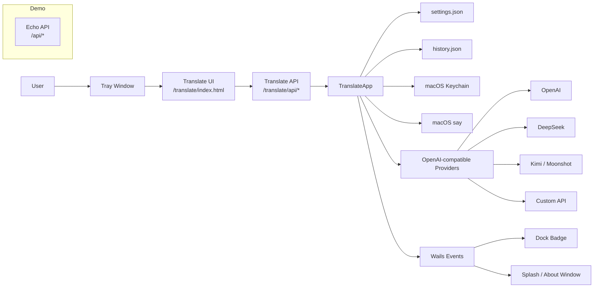

<p align="center">
  
</p>

<h1 align="center">Kakapo</h1>

<p align="center">
  <strong>Translator, but smart.</strong><br />
  更聪明的跨语言桌面翻译器：多服务商、多模型、多目标语言并行对比，API Key 安全存入系统密钥链。
</p>

<p align="center">
  <a href="https://github.com/soulteary/kakapo/actions/workflows/ci.yml">
    
  </a>
  <a href="https://github.com/soulteary/kakapo/blob/main/LICENSE">
    
  </a>
  
  
  
  
  
</p>

---

## Kakapo 是什么？

Kakapo 是一款开源桌面翻译应用，核心目标不是“调用一次模型给一个答案”，而是把翻译变成可比较、可回放、可迭代的工作流。

它可以对接 OpenAI 兼容的 `Chat Completions` 接口，例如 Kimi / Moonshot、DeepSeek、OpenAI 或你自己的兼容服务；翻译时可同时启用多个服务商、多个模型、多个目标语言，并将结果并行展示，方便你快速比较风格、准确性与延迟。

Kakapo 也是一份完整的 [Wails v3](https://v3alpha.wails.io/) 桌面应用工程参考，覆盖托盘窗口、启动页、应用菜单、主进程事件、本地配置、历史持久化、系统朗读、内置 Echo API 等常见桌面应用能力。

> 适合：高频翻译、模型效果对比、本地桌面工具开发、Wails v3 工程学习与二次开发。

---

## 功能亮点

| 能力 | 说明 |
| --- | --- |
| 多语言互译 | 支持源语言、目标语言自由配置，可一次翻译到多个目标语言 |
| 多服务商管理 | 支持 OpenAI 兼容接口，可配置 Kimi / Moonshot、DeepSeek、OpenAI、自定义服务 |
| 并行翻译对比 | 按 `服务商 × 模型 × 目标语言` 并行执行（并发上限 6），便于横向比较输出质量与速度 |
| 模型参数适配 | 针对模型族自动调参：`kimi-k2` 系列省略 `temperature`、`thinking=disabled` 并放大 `max_tokens`；`deepseek` 系列省略 `temperature`、`reasoning_effort=high`、`thinking=enabled` |
| 端点模式 | 每个服务商可选 `base`（自动追加 `/v1/chat/completions`）或 `full`（按原样使用完整 URL） |
| API Key 安全存储 | 每个服务商的 API Key 独立保存到系统 Keychain（账号名为 Provider ID），不写入 `settings.json` |
| 本地翻译历史 | 历史记录本地持久化，支持搜索、清空与结果回放 |
| 文本朗读 | macOS 下基于系统 `say` 命令按语言朗读文本（单条上限 5000 字，非 macOS 返回 501） |
| 桌面体验 | 支持托盘窗口、启动页、About 窗口、应用菜单、Dock Badge（未读翻译角标）等桌面交互 |
| 工程参考 | 内置 Echo API、Wails Service 挂载、多页面 Vite 构建、定时事件机制示例 |

---

## 预览

<!--
建议补充真实截图后开启：

<p align="center">
  
</p>
-->

```text
输入文本
   │
   ├─ Provider A / Model 1 ── English
   ├─ Provider A / Model 2 ── English
   ├─ Provider B / Model 1 ── 日本語
   └─ Provider C / Model 1 ── Français

输出结果并行返回，可比较质量、风格、延迟与错误信息。
```

---

## 技术栈

| 层级 | 技术 |
| --- | --- |
| 桌面框架 | Wails v3 / Go / 原生 WebView |
| 后端服务 | Go 1.26、Echo v4、Wails Service |
| 前端 | Vite 5、原生 JavaScript、多页面构建 |
| 任务编排 | Task（`Taskfile.yml`） |
| 依赖管理 | Go Modules、Bun |
| 配置存储 | 用户配置目录下的 `settings.json` |
| 密钥存储 | macOS Keychain（`internal/secrets`） |
| 朗读能力 | macOS `say`（`internal/speech`） |

---

## 快速开始

### 1. 克隆项目

```bash
git clone https://github.com/soulteary/kakapo.git
cd kakapo
```

### 2. 准备环境

需要安装：

- Go `1.26`
- [Bun](https://bun.sh/)
- Wails CLI：`wails3`
- Task：`task`

推荐在 macOS 上开发和运行。项目中 Keychain、系统朗读、打包流程等能力以 macOS 为优先平台；其他平台的部分能力可能降级或不可用。

### 3. 安装前端依赖

```bash
task common:install:frontend:deps
```

### 4. 开发模式运行

```bash
task dev
```

### 5. 构建与运行

```bash
task build
task run
```

### 6. 打包应用

```bash
task package
```

可选：构建通用二进制并打包（macOS）：

```bash
task darwin:build:universal
task darwin:package:universal
```

> `task build` / `task package` 会根据当前系统调用对应的 Taskfile 命名空间。若你的分支尚未包含某个平台的构建任务，请先补齐相应平台 Taskfile。

---

## 如何配置翻译服务商？

进入应用的设置页后，为每个服务商配置：

| 字段 | 说明 |
| --- | --- |
| Provider ID | 服务商唯一标识，同时用作 Keychain 账号名（留空时自动生成） |
| Type | 服务商类型，例如 `openai`、`deepseek`、`kimi` 或 `custom`（仅用于 UI 提示） |
| Base URL | OpenAI 兼容接口地址 |
| Endpoint Mode | `base`（自动追加 `/v1/chat/completions`）或 `full`（按原样使用完整 URL） |
| Models | 可用模型列表 |
| Enabled | 是否参与翻译 |
| API Key | 写入系统 Keychain，不会明文返回前端 |

默认配置内置一个 Kimi / Moonshot 服务商（`https://api.moonshot.cn/v1`，模型 `kimi-k2.6`）。翻译时，Kakapo 会读取所有启用服务商及其全部模型，并按目标语言并行请求上游接口。

其他默认值：源语言 `zh`、目标语言 `en`、超时 `30s`、`temperature` `0.2`、最大输入 `5000` 字。

---

## 数据与隐私

默认数据位于系统用户配置目录（`os.UserConfigDir()`）下的 `Kakapo` 子目录。

macOS 常见路径：

```text
~/Library/Application Support/Kakapo/settings.json
~/Library/Application Support/Kakapo/history.json
```

数据说明：

| 数据 | 位置 | 说明 |
| --- | --- | --- |
| 应用设置 | `Kakapo/settings.json` | 保存语言、模型、超时、`temperature`、输入限制、自动复制等配置 |
| 翻译历史 | `Kakapo/history.json` | 保存本地翻译记录 |
| API Key | 系统 Keychain | 不写入配置文件，不明文返回前端 |

注意：翻译文本会发送给你启用的上游模型服务。请不要输入不适合发送给第三方服务的敏感内容。

---

## API 概览

Kakapo 将翻译页面与翻译 API 通过 Wails Service 挂载在 `/translate` 下。

> 这些路由由 Wails 的内部 AssetServer 在 WebView 中提供，前端以**相对路径**调用（见 `frontend/src/projects/translate/translate-api.js`），桌面运行时不对外暴露固定 HTTP 端口，因此无法直接用 `curl` 访问。

| 方法 | 路径 | 说明 |
| --- | --- | --- |
| `POST` | `/translate/api/translate` | 执行翻译，支持多目标语言、多模型并行 |
| `GET` | `/translate/api/settings` | 读取设置，API Key 只返回是否已设置与脱敏信息 |
| `PUT` | `/translate/api/settings` | 保存设置，可写入或清空服务商 API Key |
| `GET` | `/translate/api/history` | 获取历史记录，支持 `q` 搜索 |
| `POST` | `/translate/api/history` | 写入翻译历史 |
| `DELETE` | `/translate/api/history` | 清空历史记录 |
| `POST` | `/translate/api/speak` | 朗读文本，macOS 使用 `say` |
| `POST` | `/translate/api/splash` | 请求主进程显示 About / Splash 窗口 |

翻译请求体示例（前端实际通过 `fetch` 调用）：

```js
await fetch('/translate/api/translate', {
  method: 'POST',
  headers: { 'Content-Type': 'application/json' },
  body: JSON.stringify({
    text: '你好，世界',
    sourceLanguage: 'auto',
    targetLanguages: ['English', '日本語'],
    models: ['gpt-4o-mini'],
  }),
});
```

项目还包含示例 Echo API，通过 Wails Service 挂载在 `/api`：

| 方法 | 路径 | 说明 |
| --- | --- | --- |
| `GET` | `/api/info` | 示例信息接口 |
| `GET` | `/api/users` | 示例用户列表 |
| `GET` | `/api/users/:id` | 示例用户详情 |
| `POST` | `/api/users` | 示例创建用户 |
| `DELETE` | `/api/users/:id` | 示例删除用户 |

---

## 架构概览



---

## 目录结构

```text
kakapo/
├── assets/
│   ├── icon.png
│   └── icon-active.png
├── build/
│   ├── config.yml                 # Wails 配置
│   ├── Taskfile.yml               # 公共构建任务
│   └── darwin/Taskfile.yml        # macOS 构建/打包任务
├── frontend/
│   ├── src/projects/app/          # 启动页 / 示例页面
│   ├── src/projects/translate/    # 翻译页面
│   ├── scripts/                   # 多页面构建脚本与定义
│   └── package.json
├── internal/
│   ├── config/                    # settings.json 读写
│   ├── history/                   # 翻译历史
│   ├── secrets/                   # Keychain 抽象与实现
│   ├── speech/                    # macOS say 与跨平台 stub
│   ├── translate/                 # OpenAI 兼容翻译客户端
│   └── wails/                     # tray / menu / splash / events
├── pkg/echo/                      # Echo 与 Wails Service 适配
├── appinfo.go                     # 应用元信息服务 AppInfoService
├── main.go                        # Wails app 主入口
├── server.go                      # Echo 示例服务（/api）
├── server_translate.go            # 翻译页面与 REST API（build tag !server）
├── translate.go                   # 翻译业务核心 TranslateApp
├── Taskfile.yml
└── README.md
```

---

## 当前构建元信息

`build/config.yml` 当前已配置为项目实际信息：

- `companyName`：`soulteary.com`
- `productName`：`Kakapo`
- `productIdentifier`：`com.soulteary.kakapo`
- `description`：`Translator, but smart`
- `version`：`0.0.1`

---

## 常用开发命令

```bash
# 安装前端依赖
task common:install:frontend:deps

# 开发模式
task dev

# 生成前端绑定
task common:generate:bindings

# 构建前端
task common:build:frontend

# 更新 Wails build assets
task common:update:build-assets

# 许可证头检查 / 自动补全
task common:license:check
task common:license:add
```

可选：Server / Docker（`common` 命名空间）：

```bash
task common:build:server
task common:run:server
task common:build:docker
task common:run:docker
task common:setup:docker
```

后端常用检查：

```bash
gofmt -w .
go vet ./...
go test ./...
go build ./...
```

---

## 开发注意事项

- 修改导出给前端的 Go 方法后，执行 `task common:generate:bindings`。
- 修改 `build/config.yml` 中的 `info` 或 `fileAssociations` 后，执行 `task common:update:build-assets`。
- 不要提交 API Key、`settings.json`、`history.json` 或其他敏感文件。
- 平台相关能力建议使用 build tags 拆分实现（参考 `internal/secrets`、`internal/speech`），保证非 macOS 平台至少可编译或明确降级。
- 上游 API 错误可以透传到界面，但日志与 UI 中应避免泄露敏感信息。

---

## 候选路线图

- [ ] 增加全局快捷键呼出翻译窗口
- [ ] 支持术语表 / 固定译法
- [ ] 支持流式翻译结果展示
- [ ] 增加 Windows / Linux 密钥存储后端
- [ ] 增加翻译结果收藏与导出
- [ ] 发布签名后的 macOS 安装包
- [ ] 增加更多模型参数适配策略

---

## 贡献

欢迎提交 Issue 和 Pull Request。贡献方式、本地开发与代码规范见 [CONTRIBUTING.md](CONTRIBUTING.md)。

建议在较大的功能或破坏性改动前先开 Issue 讨论方案。提交前请确认：

```bash
gofmt -w .
go vet ./...
go test ./...
go build ./...
task common:license:check
```

提交信息建议使用约定式提交，例如：

```text
feat: 新增全局快捷键呼出翻译窗口
fix: 修复历史记录搜索结果排序问题
docs: 更新服务商配置说明
```

---

## 许可证

Kakapo 基于 [Apache License 2.0](LICENSE) 开源，允许自由使用、修改、商用与再分发（含闭源分发）。

再分发或基于本项目衍生时，请遵守许可证要求：保留版权与许可声明、随附 [NOTICE](NOTICE) 中的署名信息，并对修改过的文件作出「已修改」标注，以引用并声明 Kakapo 项目为来源。

> 版权所有 © 2026 Su Yang (soulteary)。
